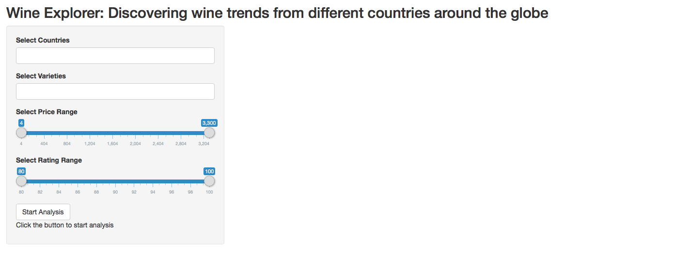
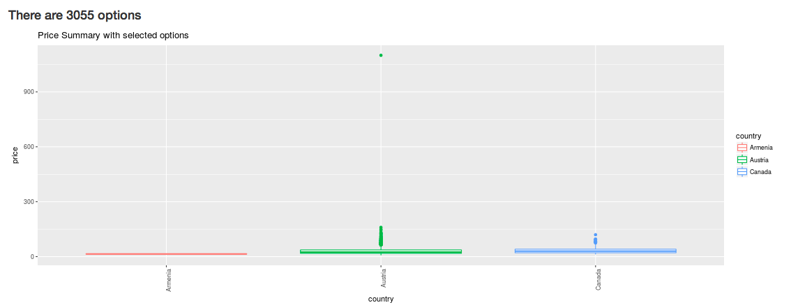
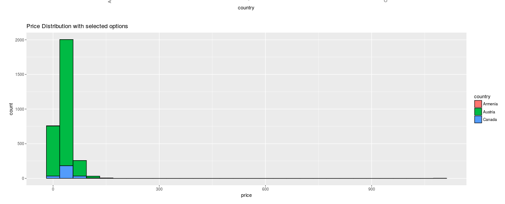
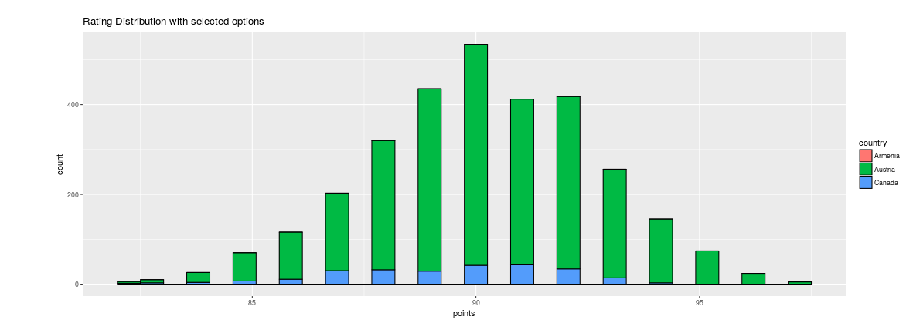
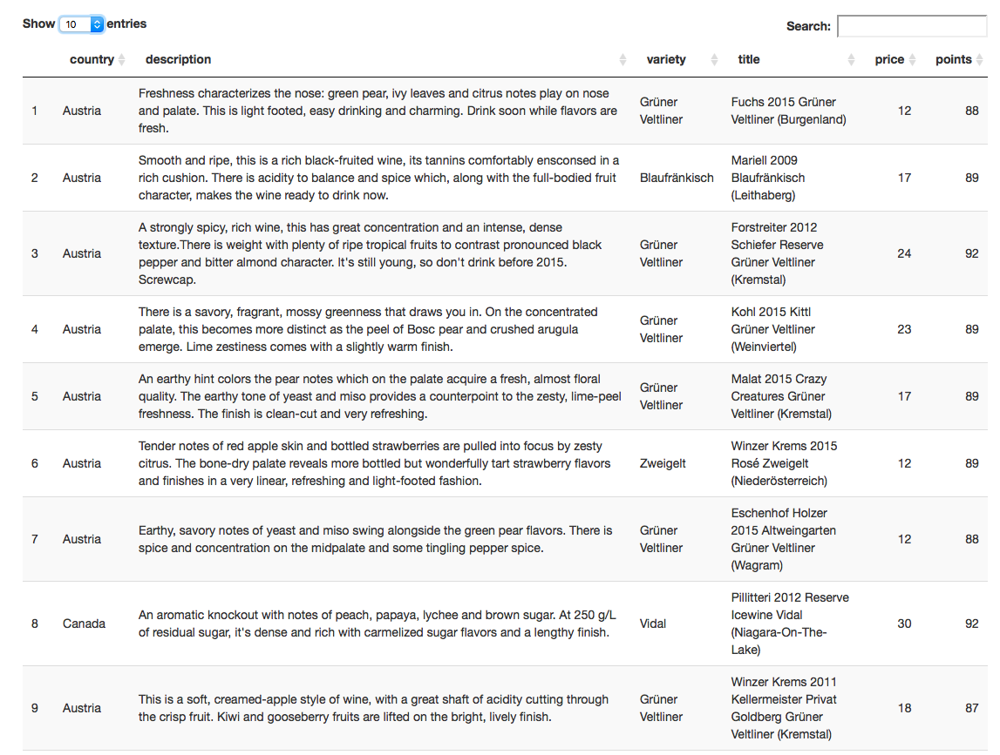

# WineFinder Shiny App

## Overview
A delectable wine definitely would  dim your memorable moments, but picking a wine is a time-consuming issue. Now, instead of spending hours and hours at liquor store, you just need to click some buttons to indicate what you  want(price,country,region, winery...etc), my app would choose the  wine for you. Also for wine lovers or researchers, you can use my app to compare or investigate wines since my dataset is reliable. It is scraped from **WineEnthusiast**, one of the authoritative website of wines. 
([Link to original dataset](https://www.kaggle.com/zynicide/wine-reviews/data))  

## How to play
Deployed app is located [here](https://vinverguan.shinyapps.io/WineFinder/)

  

1. If you want to take an overview of all observation in the dataset, you just click `start analysis` button without adjust any input above.  
2. If you want to explore particulr countries,varieties,price and rating, you could just use the input section to achieve your selection. Then click  `start analysis` button. Note: You may select multiple countries and varieties  

3. The app would generate 3 plots and one interactive table base on your selection

# Have Fun!

