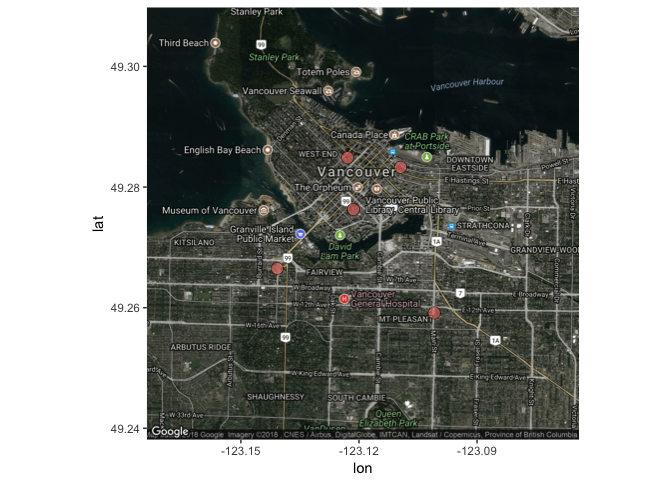

<div style="max-height:450px; max-width:450px; overflow: hidden">
   
</div>
   
   
[](https://travis-ci.org/vinverguan/yelpitout)
[](https://codecov.io/gh/vinverguan/yelpitout/)

# Yelp API 
     
### Project Contributors

1. Yinghua Guan ([@vinverguan](https://github.com/vinverguan))
2. Ying Dong ([@yvonnedy](http://github.com/yvonnedy))
3. Ruoqi Xu ([@rq1995](https://github.com/rq1995))
4. Longlingzi Yao ([@yllz](https://github.com/yllz))
    
### Installation  
   
Install this package directly from GitHub:

`devtools::install_github("vinverguan/yelpitout")`      
     
**Please define your own Yelp key as a global environment variable when using our functions.**      
    
**You can also use our Yelp key which can be found in this [`.Renviron` file](https://github.com/vinverguan/yelpitout/blob/master/.Renviron).**        
                       
### Overview   
  
Our package `yelpitout` intends to develop an R wrapper for the Yelp RESTful API.

The package provides users with three different methods to look for businesses they desire on Yelp. First, find businesses by category and location. Second, match business data by using its name on Yelp. Third, search for businesses which support food delivery transactions.

The package includes four functions. The first function `search_cat()` returns some basic information about 50 businesses based on provided category and location. `location_map()` uses the same search criteria but produces a google map visualization of the top 5 businesses ordered by review count. `name_match()` is able to return 1 business that is the best match based on name and location provided. And the last one `delivery_list()` returns up to 20 businesses that can deliver to a provided location ordered by a specified order.     

### Function Description

`search_cat(yelp_key, category, city)`  

Inputs: 

- `yelp_key`: a string representing the Yelp API key
- `category`: a string representing the category of business
- `location`: a string representing a city name

Output:   

- a dataframe containing name, rating and review count of 50 businesses

--

`location_map(yelp_key, category, city)`      

Inputs: 

- `yelp_key`: a string representing the Yelp API key
- `category`: a string representing the category of business
- `location`: a string representing a city name

Output:    

- a google map visualization of the top 5 business based on review counts

--

`name_match(key, name, city, state, country)`    
 
Inputs:   

- `key`: a string representing a Yelp API key
- `name`: a string representing the name of business
- `city`: a string representing the city name
- `state`: a string representing the state code
- `country`: a string representing the country code

Output:  

- a dataframe containing name, phone, location and postal code of a business that is the best match

--

`delivery_list(yelp_key, location, order)`     

Inputs:   

- `yelp_key`: a string representing a Yelp API key
- `location`: a string representing the delivery location, prefer zipcode
- `order`: a string representing the outcome order method, which includes price, rating and review number

Output:  

- a dataframe of max 20 restaurant that can deliver to a selected address based on selected order method
       
### Usage 
   
```
# load the package                                                   
library(yelpitout)
```  
```
result1 <- search_cat(Sys.getenv("yelp_key"), "cafe", "Vancouver")
head(result1, 1)
```   
| name | rating | review_count| 
| --- | -------- | -------- | 
| Revolver | 4.5 | 437 |    

```
result2 <- location_map(Sys.getenv("yelp_key"), "cafe", "Vancouver")
result2
```   
 
   
```
result3 <- name_match(Sys.getenv("yelp_key"), "Starbucks", "Burnaby", "BC", "CA")
result3
```   
| Name | Phone | Location | Postal Code |
| --- | -------- | -------- | -------- |
| Starbucks | +16042931325 | 4461 Lougheed Hwy | V5C 3Z6 |     
   
```
result4 <- delivery_list(Sys.getenv("yelp_key"), "98104", "Rating")
head(result4, 1)
```   
| Restaurant | Price | Rating | Review_number | Phone_number |
| ---------- | --- | -------- | -------- | -------- |
| Jars Juice | $ | 4.5 | 106 | (206)249-5988 | 
  
### Package Dependencies   
   
`ggplot2` 
   
`httr`    
 
`magrittr`  
   
`dplyr`    
 
`ggmap`
